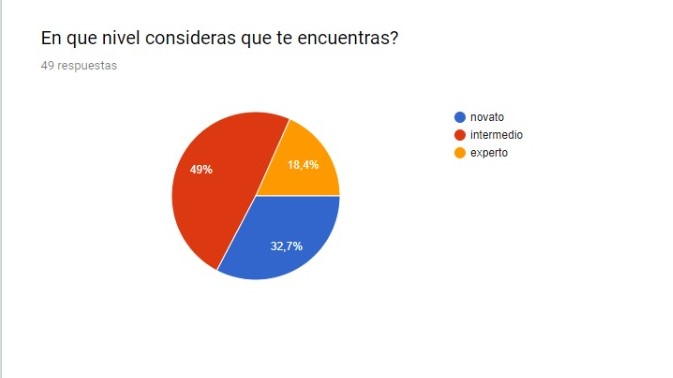
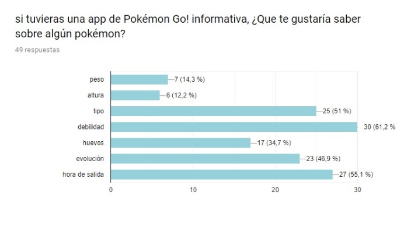
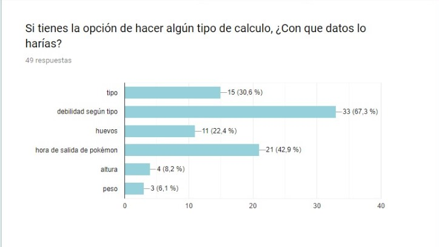
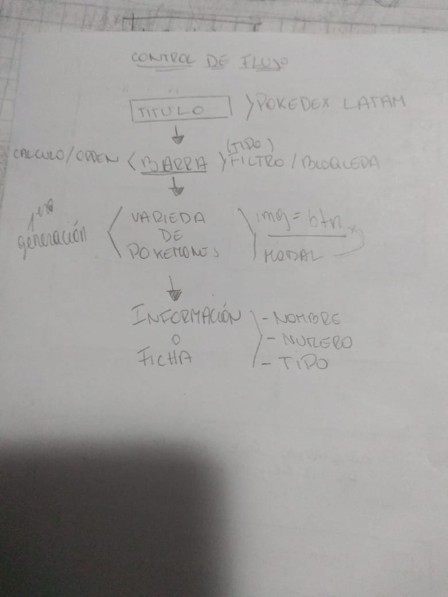
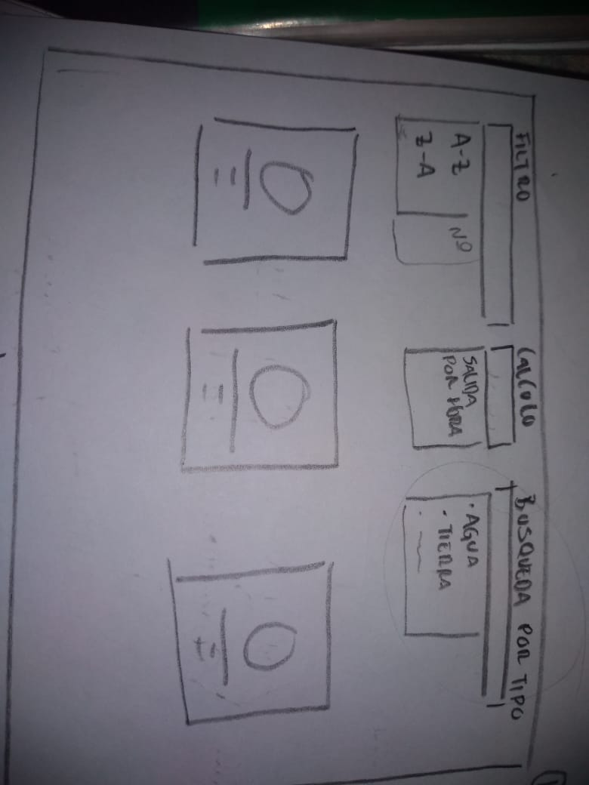
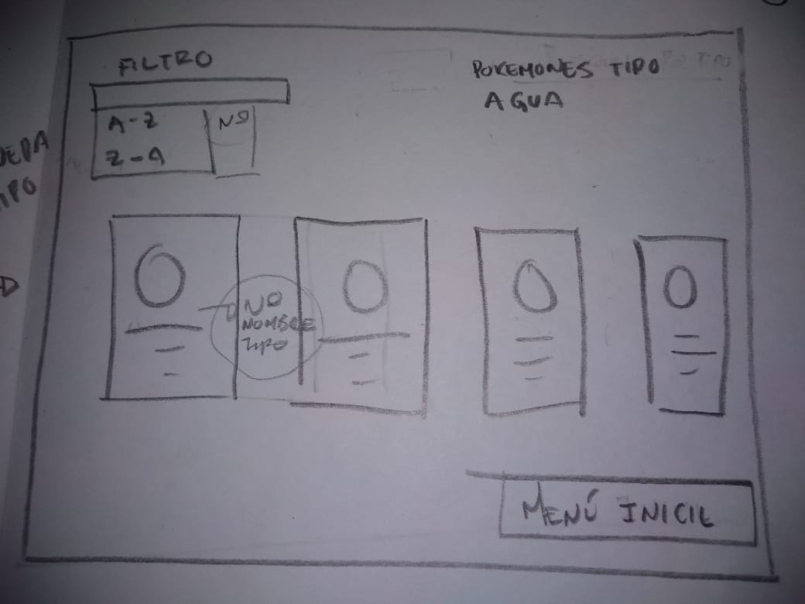
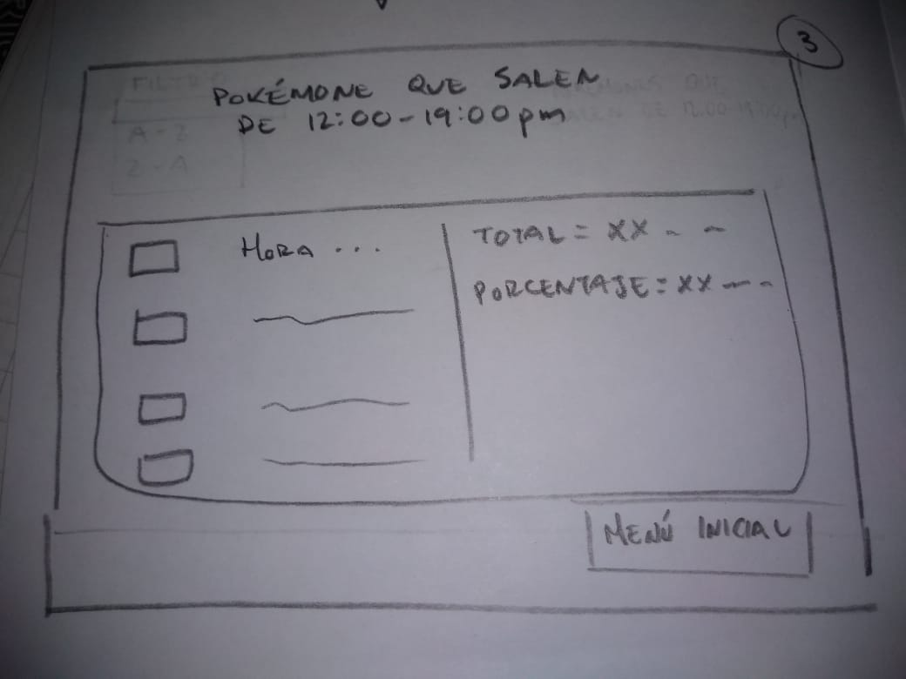

## *POKEDEX APP*

Es una página informativa de la aplicación Pokémon Go! para jugadores novatos y/o de nivel intermedio, en ella podrán encontrar todos los pokémones de la primera generación con su respectiva información la cual es el nombre, tipo, número, hora de salida y sus evoluciones. El usuario puede ordenar numéricamente, puede filtrar según tipo, calcular la hora de salida, y volver a inicio siempre que quiera.

  / [lpagina](link)

## PROTOTIPO DE BAJA FIDELIDAD 
 Para esto hicimos una [encuesta](https://docs.google.com/forms/d/e/1FAIpQLSebA2aWBVW7n2An2sUnxp1CZ5NtSrGVCcvkoVuFlW3eqmIl8w/viewform?usp=sf_link)  para saber cuales eran las necesidades de nuestro usuario.

Estos son los resultados de la encuesta:

  

  

Al hacer el  análisis nos dimos cuenta que el perfil de nuestro usuario iban a ser jugadores novatos y/o intermedio los cuales les gustaría obtener la información de la evolución de estos, el tipo y hora de salida.Después de este estudio hicimos el control de flujo y el prototipo de baja fidelidad.

## Imagen del control del flujo

## Imagen de prototipo de baja fidelidad

## PROTOTIPO DE ALTA FIDELIDAD

Al tener el de baja fidelidad, con la herramienta de diseño visual ¨Figma¨ hicimos el  [prototipo de alta fidelidad](https://www.figma.com/proto/IBQ4CpS4A5yP83N4J0QEfJCx/Untitled?node-id=34%3A1&scaling=min-zoom&redirected=1) y con este hicimos las historias de usuario y  el testeo a diferentes personas.
aqui les dejo el [link](zpl.io/VkpdpAv) de zeplin

## HISTORIAS DE USUARIO

* Historia de usuario 1: _Yo como_ usuario de Pokémon Go _quiero_ filtrar los pokemones por tipo _para_ reconocer los pokemones que poseo.

* Historia de usuario 2: _Yo como_ usuario de Pokémon Go _quiero_ filtrar los pokemones por tipo _para_ saber con cuál pokémon atacar o defenderme en las batallas.

* Historia de usuario 3: _Yo como_ usuario de pokémon go! _quiero_ ordenar los pokémones por número, de manera creciente y decreciente, _para_ tener diferente vistas de los pokémones mostrados.

* Historia de usuario 4:  _Yo como_ usuario de Pokémon Go _quiero_ tener un cálculo por hora de salida de los pokemones _para_ capturar los que me faltan.

## Testeos

 
* Testeo 1: [audio](https://soundcloud.com/dharma-herrera/beta)

* Testeo 2: [audio](https://soundcloud.com/dharma-herrera/gelen)  

* Testeo 3: [audio](https://soundcloud.com/dharma-herrera/nohemi)

* Testeo 4: [audio](https://soundcloud.com/dharma-herrera/stefany)

* Testeo 5: [audio](https://soundcloud.com/dharma-herrera/urzula)

* testeo 6: [audio](https://soundcloud.com/dharma-herrera/ignacio)

## Conclusión

* Para el usuario era de facilidad hacer las tareas que se le otorgaron.  
* nos pidieron incluir un buscador
* que el botón de inicio estuviera visible al inicio de la página

De estas dos sugerencias logramos solucionar una la cual era del botón de inicio, mientras que incluir el buscador se dejara como  implementación mas adelante.